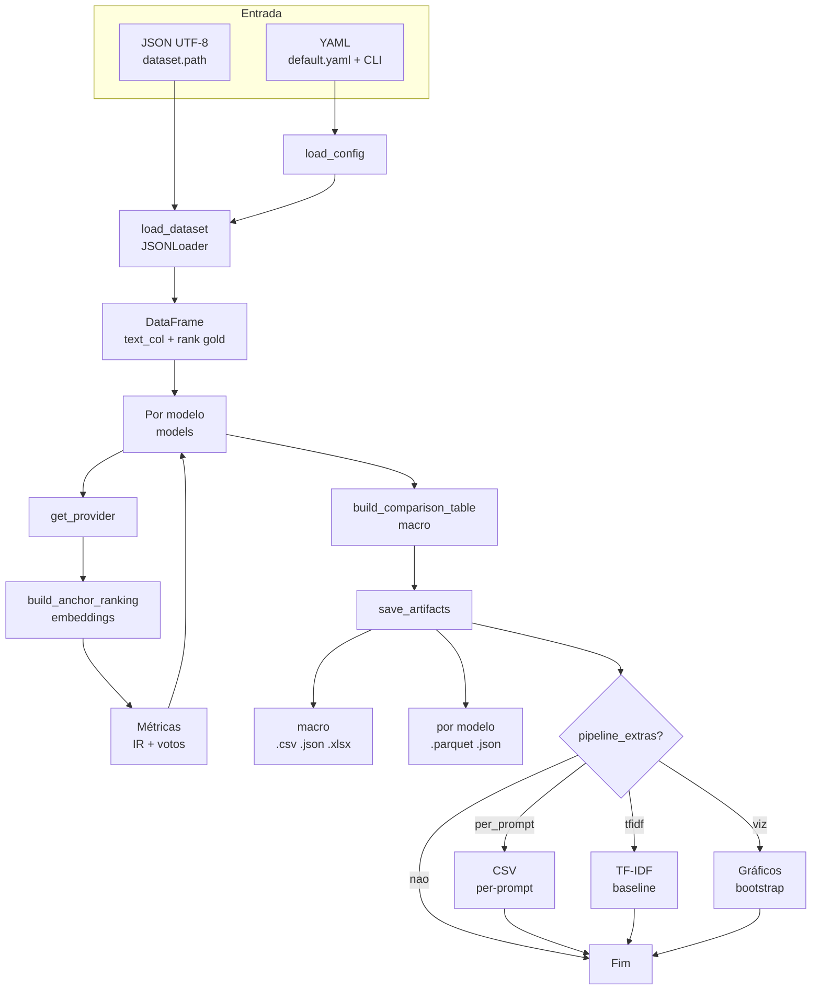

# embedding-models-eval

Pipeline de avaliação de embeddings: ranking por âncora, métricas IR e de votos, saídas tabulares/JSON, etapas opcionais (TF-IDF, visualizações com bootstrap) via YAML.

## Fluxo end to end (JSON até saída)

O comando `embedding-eval` (ou `run_pipeline.py`) chama `run_experiment` em `embedding_models_eval.pipeline.runner`: primeiro carrega configuração e dataset; depois, para cada modelo, gera embeddings, ranqueia por âncora e calcula métricas; em seguida agrega, grava artefatos em `output.results_dir` e, se o YAML habilitar, executa `pipeline_extras`.

**Ranking por âncora:** em cada grupo definido por `ranking.group_cols`, o texto do item com rank gold igual a `ranking.anchor_rank` (por padrão 1, alinhado a `rank_in_prompt`) é a **âncora**; os demais candidatos são ordenados por similaridade de embedding em relação a esse texto. Assim a avaliação mede se o modelo recupera a ordem humana quando a referência é o melhor item do prompt.



Legenda do diagrama: `per_prompt` = `save_per_prompt_metrics`, `tfidf` = `run_tfidf_baseline`, `viz` = `run_visualizations` no YAML; aresta `nao` = extras desligados.

Detalhes de chaves JSON e colunas do DataFrame estão na seção **Ingestão do dataset** abaixo. A lista de arquivos gravados em `output.results_dir` está em **Artefatos principais** (seção **Parametrização e dados**).

## Requisitos

- Python 3.10 ou superior
- Dados de entrada no formato esperado pelo loader JSON (ex.: `saida_final.json`)
- Para modelos OpenAI: variável `OPENAI_API_KEY` (ou `.env` carregado pelo `config_loader`)

## Instalação (recomendado)

Na pasta `embedding_models_eval` do repositório:

```bash
python -m venv .venv
source .venv/bin/activate   # Windows: .venv\Scripts\activate
pip install -e .
```

O comando acima instala **somente** as dependências **obrigatórias** declaradas em `pyproject.toml` (pandas, torch, sentence-transformers, openai, ranx, etc.), suficientes para rodar o pipeline principal e gerar artefatos (CSV, Parquet, JSON, métricas).

Para incluir **extras**, veja a seção seguinte.

### Primeira execução (checklist)

1. Entrar na pasta `embedding_models_eval` do repositório (de onde o `pip install -e .` foi feito).
2. Ativar o ambiente virtual (`.venv` ou outro) onde o pacote está instalado.
3. Ajustar `dataset.path` no YAML (e demais chaves necessárias) para apontar para o seu JSON de entrada.
4. Rodar o pipeline a partir dessa pasta, para que caminhos relativos do YAML batam com o diretório atual, por exemplo: `embedding-eval --config configs/default.yaml` (ou `--output-dir` se quiser outra pasta de resultados).

### Instalação direto do Git

Ajuste URL, branch e use `#subdirectory=embedding_models_eval` se o pacote estiver nessa pasta no monorepo:

```bash
pip install "git+https://github.com/Labic-ICMC-USP/LLM-CreativityScore.git@BRANCH#subdirectory=embedding_models_eval"
```

Extras na URL (exemplo com visualizações e testes):

```bash
pip install "embedding-models-eval[viz,dev] @ git+https://github.com/Labic-ICMC-USP/LLM-CreativityScore.git@BRANCH#subdirectory=embedding_models_eval"
```

(A sintaxe exata pode variar com a versão do `pip`; em caso de dúvida, clone e use `pip install -e ".[viz,dev]"` na pasta.)

## Dependências opcionais (extras)

No `pyproject.toml`, o projeto define **grupos opcionais** (`[project.optional-dependencies]`). Eles existem para **não** obrigar todo mundo a instalar pacotes que só fazem sentido em certos cenários (plots, ou suite de testes).

### Por que separar?

| Cenário | O que você precisa |
|---------|---------------------|
| Só rodar experimentos (`embedding-eval`) | Dependências base (`pip install -e .`) |
| Ativar `pipeline_extras.run_visualizations` no YAML | Bibliotecas de plotagem (`[viz]`) |
| Rodar `pytest` no repositório | Ferramentas de teste (`[dev]`) |

Assim quem **consome** o pacote para produção ou estudos não puxa `pytest` nem `matplotlib` sem necessidade; quem **desenvolve** ou valida o código instala o que falta com um único sufixo.

### Extra `[viz]` (visualizações)

- **O que instala:** `matplotlib`, `seaborn` (versões mínimas no `pyproject.toml`).
- **Para que serve:** o pipeline pode, se `pipeline_extras.run_visualizations: true` no YAML, gerar boxplots, violins e gráficos de intervalo de confiança (bootstrap) a partir dos CSVs per-prompt. Esse código importa `matplotlib` e `seaborn`; sem o extra, essa etapa pode falhar ao importar.
- **Comando:** `pip install -e ".[viz]"` ou combine com outros: `pip install -e ".[viz,dev]"`.

### Extra `[dev]` (desenvolvimento)

- **O que instala:** `pytest`, `pytest-cov` (testes e cobertura de código).
- **Para que serve:**
  - **`pytest`:** executa a suite em `tests/` (`pytest tests/` ou `pytest` com `pytest.ini`).
  - **`pytest-cov`:** opcional para relatórios de cobertura (ex.: `pytest --cov=embedding_models_eval`), útil em CI ou revisão de qualidade.
- **Quem precisa:** mantenedores, integração contínua, ou qualquer pessoa que queira **verificar** que o pacote passa nos testes após mudanças. **Não** é necessário para apenas **rodar** `embedding-eval` com seus dados.
- **Comando:** `pip install -e ".[dev]"`.

### Combinando extras

Você pode pedir vários de uma vez, separados por vírgula **dentro das aspas**:

```bash
pip install -e ".[viz,dev]"
```

Ordem não importa. Exemplos:

- Base + plots: `pip install -e ".[viz]"`
- Base + testes: `pip install -e ".[dev]"`
- Tudo para quem desenvolve e gera figuras integradas: `pip install -e ".[viz,dev]"`

### Onde isso está definido

Abra `pyproject.toml` e procure `[project.optional-dependencies]`. Ali ficam os nomes exatos (`viz`, `dev`) e as versões; se o grupo adicionar outro extra no futuro (por exemplo ferramentas de lint), a mesma ideia se aplica: `pip install -e ".[novo_extra]"`.

## Comandos (após `pip install -e`)

| Comando | Descrição |
|---------|-----------|
| `embedding-eval` | Pipeline principal (embeddings + métricas + artefatos) |
| `embedding-viz` | Boxplots, violin e bootstrap (CSVs per-prompt) |
| `embedding-tfidf` | Baseline TF-IDF |

Exemplo:

```bash
embedding-eval --config configs/default.yaml
embedding-eval --config configs/default.yaml --models minilm --output-dir results/teste
```

## Sem instalar o pacote (clone apenas)

Defina `PYTHONPATH` para `src` e use os shims na raiz:

```bash
cd embedding_models_eval
PYTHONPATH=src python run_pipeline.py --config configs/default.yaml
```

## Parametrização e dados (YAML)

1. Copie e edite `configs/default.yaml` (`dataset`, `models`, `output`, `pipeline_extras`, `ranking`, …).
2. **Saída**: `output.results_dir` no YAML ou `--output-dir` na CLI.

A seção `dataset` controla a **ingestão** (veja abaixo).

### Artefatos principais (`output.results_dir`)

Tudo abaixo é criado por `save_artifacts` quando as flags em `output` do YAML estão ativas (em `default.yaml` o resumo e o detalhado costumam vir `true`; ajuste `save_summary`, `save_detailed`, `save_summary_json`, `save_detailed_json`, `save_summary_excel`, etc., se quiser menos arquivos ou sem Excel).

| Arquivo | Conteúdo |
|----------|-----------|
| `comparacao_modelos_macro.csv` | Tabela macro: uma linha por modelo, métricas IR (ex.: MAP@k) e de votos agregadas. |
| `comparacao_modelos_macro.json` | Mesmo macro em JSON (registros). |
| `comparacao_modelos_macro.xlsx` | Mesmo macro em Excel, se `openpyxl` estiver disponível. |
| `<nome_do_modelo>_detalhado.parquet` | Por modelo da lista `models`: DataFrame com scores e colunas usadas na avaliação. |
| `<nome_do_modelo>_detalhado.json` | Versão JSON do detalhado (pode ficar grande; há flag para desativar). |

O `<nome_do_modelo>` é o campo `name` de cada entrada em `models` no YAML (ex.: `minilm`, `openai_small`). Extras (`pipeline_extras`) gravam CSVs, pastas TF-IDF e figuras em subpastas dentro ou ao lado de `results_dir`; ver `configs/default.yaml` e a legenda do fluxograma acima.

## Orquestração em múltiplas execuções (Open WebUI, jobs)

Este pacote implementa **somente a primeira etapa** de um pipeline que o grupo pode montar em ferramentas externas:

1. **Execução 1 (este pacote):** embeddings, ranking por âncora, métricas e artefatos em `output.results_dir`.
2. **Execução 2 (fora deste pacote):** outro script ou tool (ex.: LLM juiz) que gera **outro ranking** ou scores sobre os mesmos itens.
3. **Execução 3 (fora deste pacote):** código que **combina** as duas saídas (média de posições, pesos, RRF, etc.).

São **três execuções distintas** encadeadas pelo orquestrador; o CLI `embedding-eval` e o YAML continuam válidos e **não** embutem juiz nem fusão.

### Contrato de saída (v1) para as etapas seguintes

Nos arquivos `<nome_do_modelo>_detalhado.parquet` e `<nome_do_modelo>_detalhado.json` (quando `save_detailed` / `save_detailed_json` estão ativos), cada linha reflete o DataFrame após `build_anchor_ranking`. Colunas **estáveis** para alinhar com a saída do juiz e com a etapa de fusão:

| Coluna | Papel |
|--------|--------|
| `prompt_id` | Identificador do prompt (derivado de `ranking.group_cols`). |
| `doc_id` | Identificador do candidato (por padrão `story_url`, ou sintético se faltar URL). |
| `rank_in_prompt` | Posição humana no grupo (gold bruto). |
| `rank_gold` / `rank_pred` | Ranks na lógica por âncora (ver `ranking/anchor.py`). |
| `score_to_anchor` | Similaridade (coseno) com o embedding da âncora. |

A etapa do juiz deve publicar chaves de junção **compatíveis** (`prompt_id` e `doc_id`, ou convenção explícita com `story_url`) para o terceiro passo cruzar tabelas sem ambiguidade. Este documento marca o contrato como **v1**; evoluções futuras devem versionar se quebrarem colunas ou significados.

### API aditiva: `run_experiment_from_config_dict`

Quando o orquestrador monta a configuração em memória (sem gravar YAML), use a função exportada pelo pacote (mesma validação e mesmo pipeline que `load_config` + `run_experiment`):

```python
from embedding_models_eval.pipeline import run_experiment_from_config_dict

result = run_experiment_from_config_dict(
    config,
    load_env=True,
    verbose=True,
    continue_on_error=True,
)
```

Ordem interna: opcionalmente `load_env_robust` (mesmos caminhos de `.env` que `load_config`), substituição recursiva de `${VAR}` nas strings, `validate_config`, depois `run_experiment`. O dicionário `config` passado pelo chamador **não** é alterado. O retorno é a mesma estrutura retornada por `run_experiment` (artefatos, métricas macro, `per_prompt_metrics`, `pipeline_extras_report`).

Para arquivo YAML em disco, continue usando `load_config` com caminho no disco e `run_experiment`, ou apenas `embedding-eval --config ...`.

## Ingestão do dataset (JSON)

O pipeline carrega o arquivo indicado em **`dataset.path`** no YAML (caminho **relativo ao diretório de trabalho** de onde você roda o comando, ou caminho **absoluto**). Encoding esperado: **UTF-8**.

### Loader padrão (`json`)

O registro `get_loader("json", …)` usa `JSONLoader` (`embedding_models_eval.data.json_loader`). Ele espera um JSON com **lista de concursos** ou **um único objeto concurso**, cada um com esta hierarquia lógica:

- **Concurso (contest):** chaves usadas pelo parser incluem `Number`, `Title`, `URL`, `Prize_Value`, `Ended`, `Scraped_At`, e **`Prompts`** (lista).
- **Prompt:** em cada item de `Prompts`, campos como `Title`, `URL`, `Posted`, `Texts_Count`, `Scraped_At`, e **`Texts`** (lista de histórias).
- **História (texto candidato):** em cada item de `Texts`, o parser lê entre outros:
  - `Title`, `URL`, `Author`, `Posted`, `Award`, `Tags`, **`Likes`**, **`Comments`**, `Content`
  - **`Extracted_idea`**: objeto com chaves opcionais **`50`**, **`150`**, **`250`** (textos de ideia em diferentes tamanhos; o padrão do YAML é embedar `extracted_idea_250`).

Ou seja: **Concursos → Prompts → Texts**, com engajamento (`Likes` / `Comments`) e texto em `Extracted_idea` / `Content`.

### O que o loader produz (DataFrame)

Após carregar, o código:

- Ordena linhas por grupo (`contest_number`, `context_prompt_url` por padrão) usando `likes` e `comments` para definir ordem dentro do prompt.
- Cria **`rank_in_prompt`** (1 = topo do prompt segundo essa ordenação gold).
- Expõe colunas como `contest_number`, `context_prompt_url`, `story_url`, colunas de texto (`extracted_idea_*`, `story_content`), etc.

O ranking por âncora (`build_anchor_ranking`) exige a coluna de texto configurada em **`dataset.text_col`** (ex.: `extracted_idea_250`) e usa **`rank_in_prompt`** e **`ranking.group_cols`** do YAML (devem bater com o agrupamento do dataset).

### Campos úteis no `dataset` (YAML)

| Chave | Papel |
|-------|--------|
| `path` | Arquivo JSON de entrada |
| `text_col` | Coluna usada para gerar embeddings |
| `truncate_content` | Limite de caracteres em `story_content` (0 = sem corte) |

Opções avançadas do loader JSON (se passadas na config do dataset) incluem `group_cols` e `rank_by` (`likes` ou `comments`); o pipeline principal usa `load_dataset` com os campos do YAML — alinhe `ranking.group_cols` com o agrupamento esperado (padrão: `contest_number`, `context_prompt_url`).

### Referência de implementação

Para o contrato exato de chaves JSON, veja `iter_rows` em `src/embedding_models_eval/data/json_loader.py`. Para um arquivo de exemplo, use o mesmo formato do `saida_final.json` do projeto (quando disponível no repositório).

## Testes

Requer o extra **`[dev]`** (inclui `pytest`). Opcionalmente use também `[viz]` se algum teste ou fluxo local depender de matplotlib (na suite atual o foco é `pytest`).

```bash
cd embedding_models_eval
pip install -e ".[dev]"
pytest tests/
```

Com visualizações e testes juntos:

```bash
pip install -e ".[viz,dev]"
pytest tests/
```

## Estrutura (resumo)

- `src/embedding_models_eval/` — código importável (`pipeline`, `data`, `embeddings`, `metrics`, `ranking`, `cli.py`, …)
- `configs/` — YAML de referência
- `tests/` — pytest
- `run_pipeline.py`, `run_visualizations.py`, `run_tfidf_baseline.py` — atalhos que delegam ao pacote

## Documentação adicional

- `README_RUN_EMBEDDINGS.md` — guia focado em fluxos com `run_embeddings_only.py` e dependências legadas (`requirements.txt`).
- `requirements.txt` — ainda útil para ambientes sem instalar o projeto como pacote.
